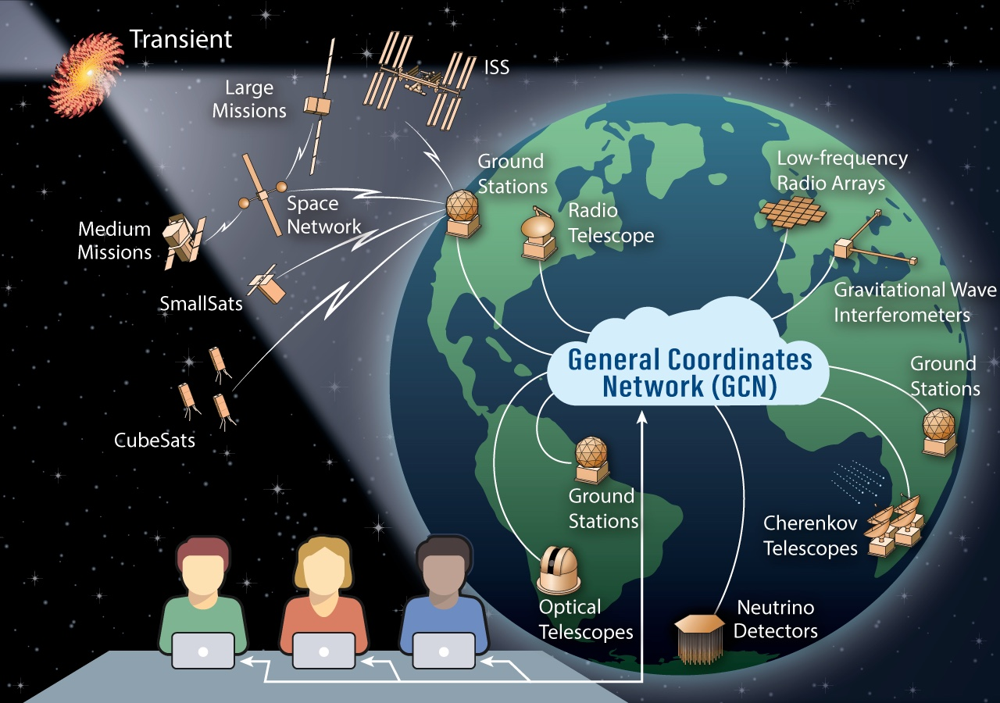

# General Coordinates Network Web Site

This is the source code for the General Coordinates Network web site, [https://gcn.nasa.gov](https://gcn.nasa.gov). The General Coordinates Network (GCN) is a public collaboration platform run by NASA for the astronomy research community to share alerts and rapid communications about high-energy, multimessenger, and transient phenomena.

GCN distributes alerts between space- and ground-based observatories, physics experiments, and thousands of astronomers around the world.

For more information, see [What is GCN?](https://gcn.nasa.gov/docs/#what-is-gcn) or check out our [slide deck](https://nasa-gcn.github.io/gcn-presentation/).

## Getting started for local development

See the [Contributing guide](https://gcn.nasa.gov/docs/contributing) for instructions on getting started!
