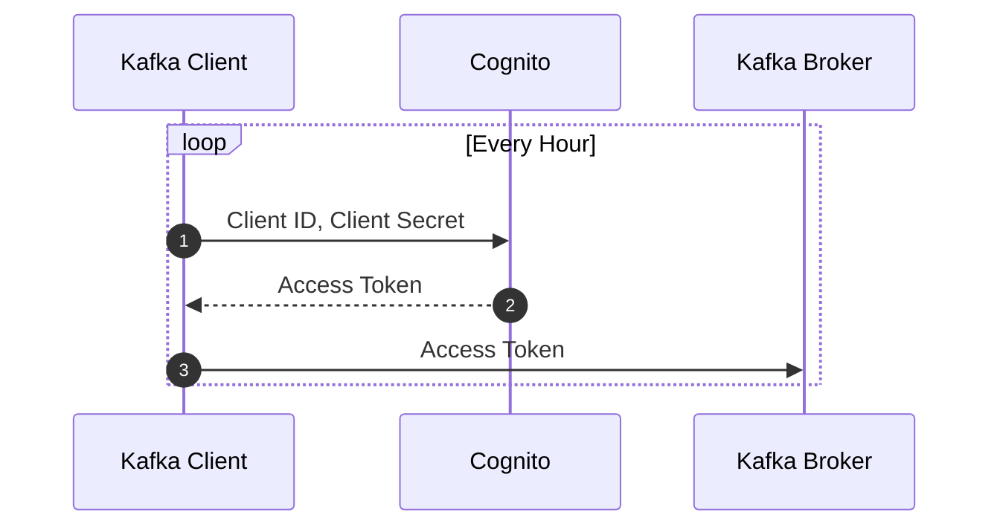

---
handle:
  breadcrumb: Authentication and Authorization
---

# Authentication and Authorization

Kafka is usually employed within an organization that has central control over who can produce or consume topics. The way that GCN uses Kafka is unique in that there are a very large number of consumers, and that the consumers are members of the general public rather than members of a single organization. GCN's authentication and authorization design makes this use case possible with Kafka.

Apache Kafka supports [Access Control Lists (ACLs)](https://kafka.apache.org/documentation/#security_authz) to configure authorized actions and topics for each user. Unfortunately, the common guidance is that a given Kafka cluster should have [no more than 1000 ACLs](https://docs.confluent.io/platform/current/security/authorization/rbac/overview.html#rbac-limitations). Since GCN has well over 1000 users, it is impractical to have an ACL for each user of GCN.

Instead, GCN uses [OpenID Connect](https://openid.net/) to integrate the Apache Kafka broker with an external identity provider. OpenID Connect support was added to Apache Kafka in [Kafka Enhancmenet Proposal (KIP) 768](https://cwiki.apache.org/confluence/pages/viewpage.action?pageId=186877575), released in Apache Kafka 3.1.0.

GCN uses [Amazon Cognito](https://aws.amazon.com/pm/cognito/), a managed, OpenID Connect compatible, single sign on provider, for login to the GCN web site. Kafka's OpenID Connect support lets us also use Cognito for machine-to-machine (M2M) authentication of Kafka clients.

## Obtaining Client Credentials

OpenID Connect supports several different authorization flows for different use cases. Kafka directly supports the Client Credentials Flow [see RFC 6749, Section 4.4](https://datatracker.ietf.org/doc/html/rfc6749#section-4.4) which is designed for machine-to-machine (M2M) authentication.

A user that is signed in to the GCN web site can navigate to the [client credentials page](/user/credentials) to create, manage, or delete client credentials that are assigned to them. When the user requests a new client credential, the web application calls the Cognito API to create a new [app client](https://docs.aws.amazon.com/cognito/latest/developerguide/user-pool-settings-client-apps.html#user-pool-settings-client-apps.title). The web application store a record in its database to keep track of the ownership of that client ID by that user.

## Kafka Client Operation

Once the user has a client ID and client secret, they can configure any of the [supported Kafka client libraries](/docs/client) to connect to GCN's Kafka broker. When the Kafka client starts up, it first sends the client ID and client secret to Cognito's OpenID Connect token endpoint over HTTPS. Cognito responds to the client with an access token which is valid for 1 hour. The Kafka client sends the access token to the Kafka broker. Finally, the Kafka broker makes an authorization decision based on the token. If successful, the Kafka session is now authorized. The client repeats the process shortly before the access token expires.



## Kafka Broker Operation

The access token is a [JSON Web Token (JWT)](https://jwt.io), which is essentially a JSON document wrapped in a cryptographic signature. Each field in the JSON document is called a claim. The `scope` claim defines the resources tha the bearer of the token may acccess. In GCN, examples of scopes include `gcn.nasa.gov/kafka-public-consumer` and `gcn.nasa.gov/kafka-igwn-producer`.

The Kafka broker checks that the access token came from Cognito by verifying its signature against Cognito's public key. If the signature is valid, then it decodes the `scope` claim from the access token, and sets the Kafka user principal to its value. We have configured a small number of Kafka ACLs that are keyed on these principals. Kafka makes the authorization decision based on the ACLs that match the principal.

## Kafka Broker Configuration

The relevant parts of the Kafka broker configuration are as follows:

```ini
authorizer.class.name=kafka.security.authorizer.AclAuthorizer
listener.name.external.oauthbearer.sasl.jaas.config=org.apache.kafka.common.security.oauthbearer.OAuthBearerLoginModule required;
listener.name.external.oauthbearer.sasl.server.callback.handler.class=org.apache.kafka.common.security.oauthbearer.secured.OAuthBearerValidatorCallbackHandler
sasl.enabled.mechanisms=OAUTHBEARER
sasl.oauthbearer.jwks.endpoint.url=https://cognito-idp.us-east-1.amazonaws.com/.../.well-known/jwks.json
sasl.oauthbearer.sub.claim.name=scope
```
